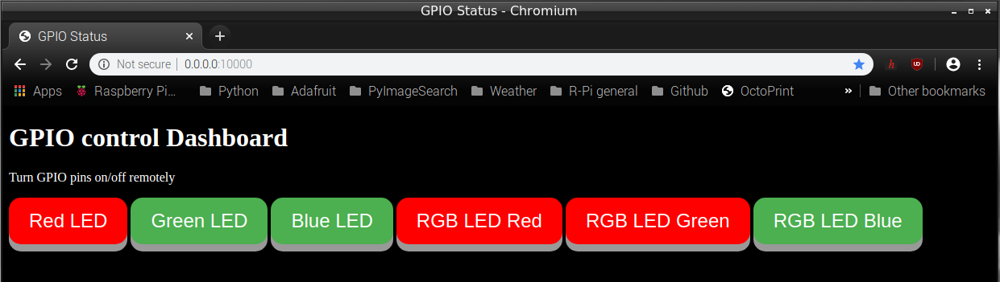

# Basic GPIO dashboard

This is a flask server that makes a web page with buttons for controlling GPIO pins




Inspired by [Matt Richardson's tutorial](http://mattrichardson.com/Raspberry-Pi-Flask/). The difference is that GPIOs are controlled by buttons on the web page and the page does not reload every time a GPIO is changed. It uses a small Javascript function to set the GPIO through the flask URL interface.

The server reads a .csv file called *pin_table.csv* which looks like this:

| pin | name          | state |
| --- | ------------- | ----- |
| 8   | Red LED       | off   |
| 25  | Green LED     | off   |
| 24  | Blue LED      | off   |
| 10  | RGB LED Red   | off   |
| 9   | RGB LED Green | off   |
| 11  | RGB LED Blue  | off   |

The rows of the table determine how many buttons to create and which GPIOs they refer to. The columns are used to:
* _pin_ : Set GPIO pin controlled by button
* _name_: Sets the name displayed on the button
* _state_ : Sets the initial state of the GPIO pin

# Code 
The code is not that difficult and is adapted from Matt Richardson's version. The GPIO pins are set using a function called *setPin()* in *main.py* which is basically taken from Matt's code. The key differences are in the *body* section of *main.html*. 

```html
:
<body>
   <h1>GPIO control Dashboard</h1>
   
   <p>
   Turn GPIO pins on/off remotely
   </p>

   

      
         <!-- Set colours for Off state -->
         <button id = {{'pin%i' % pin}} class="button_off" onclick="pinToggle(this,{{pin}})"> {{pins[pin].name}} </button>
      
         <!-- Set colours for On state -->
         <button id = {{'pin%i' % pin}} class="button_on" onclick="pinToggle(this,{{pin}})"> {{pins[pin].name}} </button>
      

   
   
   
</body>
:
```
In this snippet from *main.html* the [Jinja template library](https://jinja.palletsprojects.com/en/2.11.x/ ) is being used to create the buttons in a loop. The columns from *pin_table.csv* are being used directly to set the name and the ID of each button. The state of the button is used to determine which CSS class to colour the button with. These are defined in the file */static/styles.css* as *button_on* and *button_off* and can be adapted to the user's preference. 

The key to updating the buttons is in the *onclick* property. This is being directed to a Javascript function called *pinToggle()* which will be responsible for both setting the GPIO state and changing the colour of the web page button to reflect that state.

*pinToggle()* is basically a call to the flask server *setPin()* function, via Javascript. This function takes the pin number as an input argument. 

*pinToggle()* first changes the colour of the button by switching which CSS class is used. Then it makes a call to the flask server *setPin()* to toggle the state of the GPIO pin.

```javascript
<script>
   
   function pinToggle(e,pin) {
      // Toggle the GPIO state and Change button colour
      
      // Check state of pin by looking at which CSS class it contains
      if (document.getElementById("pin"+pin).classList.contains('button_off'))
      {
         // Was in Off state, going to On state
         // - switch the CSS class
         document.getElementById("pin"+pin).classList.remove('button_off');
         document.getElementById("pin"+pin).classList.add('button_on');
      }
      else
      {
         // Was in On state, going to Off state
         document.getElementById("pin"+pin).classList.remove('button_on');
         document.getElementById("pin"+pin).classList.add('button_off');
      }

      // Create request object and send to flask setpin() function 
      // with the pin number
      var xhttp = new XMLHttpRequest();  
      xhttp.open("GET", "setpin/"+pin+"/toggle", true);
      xhttp.send();

   }

</script>

```

# Running the server

From the Raspberry Pi command line change to this directory and run:

```
python3 main.py
```

Then go to a web browser (Chrome on R-Pi) and put in this URL: 
* For local Raspberry Pi: *http://0.0.0.0:10000/*
* For other computer on network: *http://R-Pi IP address:10000/*

